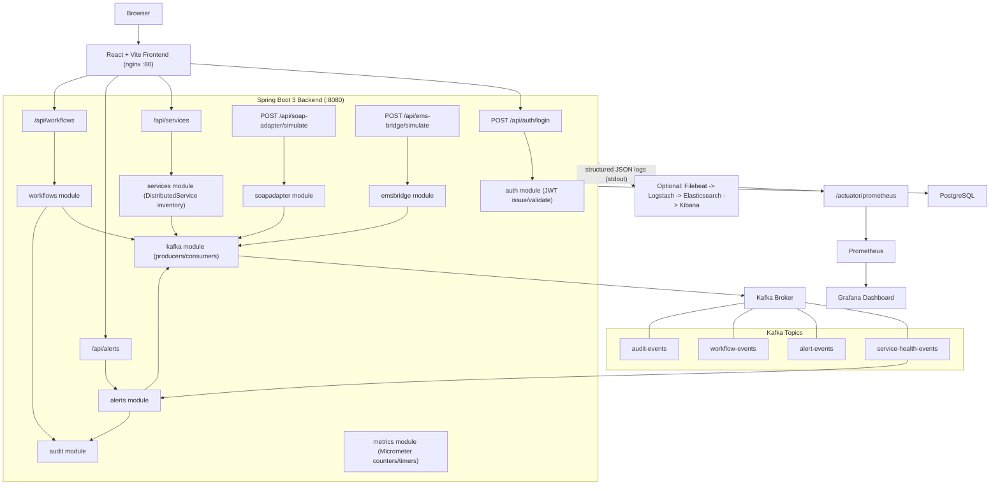

# Distributed Operations Control Plane

[](https://github.com/Aravind-blip/distributed-operations-control-plane/actions/workflows/ci.yml)

A simulated single-pane-of-glass operations platform for monitoring
distributed services, health events, alerts, and workflows across a
fictional enterprise environment.

> **Disclaimer:** This is a portfolio/demo project. All data, services,
> "legacy" SOAP/EMS integrations, and infrastructure are **simulated**.
> There is no real company data, no real production infrastructure, and
> no real third-party systems involved anywhere in this repository.

## Live Demo

| Service | URL |
|---|---|
| Dashboard (frontend) | https://frontend-production-ee3f.up.railway.app |
| API (backend) | https://backend-production-6a555.up.railway.app |
| Metrics (Prometheus) | https://prometheus-production-ac6c.up.railway.app |

Deployed on Railway: real Postgres, a real single-node Kafka broker (KRaft
mode) running the same health-event-simulator -> alert -> audit pipeline as
local, and Prometheus scraping the live backend. Log in with any of the
[demo credentials](#demo-credentials) below.

Grafana is intentionally not deployed here -- Railway's free tier caps out
at 5 services, and this stack already uses all 5 (Postgres, Kafka, backend,
frontend, Prometheus). The provisioned Grafana dashboard still exists and
works locally via `docker compose up`; Prometheus's own built-in graph
browser at the URL above covers ad hoc metric queries on the live demo.
Deploy configs specific to this Railway deployment (Prometheus/Grafana
Dockerfiles using Railway's private-network hostnames instead of
docker-compose service names) live under `deploy/railway/`.

## Why This Project Was Built

This repo exists to demonstrate hands-on, end-to-end engineering across
the stack that enterprise Java / distributed-systems roles care about:

- **Enterprise Java backend engineering** - Spring Boot 3 on Java 17, layered
  module structure (auth, users, services, alerts, workflows, audit).
- **Distributed systems & event-driven architecture** - Kafka-backed event
  pipeline connecting service health signals to alerting and workflows.
- **Observability** - Spring Boot Actuator + Micrometer metrics scraped by
  Prometheus and visualized in a provisioned Grafana dashboard.
- **Secure APIs** - JWT authentication, BCrypt password hashing, and
  role-based access control (RBAC) enforced at the API layer.
- **CI/CD** - a declarative Jenkins pipeline building, testing, containerizing,
  and deploying both the backend and frontend.
- **Kubernetes / OpenShift deployment readiness** - plain Kubernetes manifests
  plus OpenShift-specific Route/SCC considerations.

## Architecture



## Tech Stack

| Layer            | Technology                                                        |
|-------------------|--------------------------------------------------------------------|
| Frontend          | React + TypeScript + Vite, served via nginx                        |
| Backend           | Java 17, Spring Boot 3, Spring Security, Spring Data JPA, Spring Kafka |
| Database          | PostgreSQL 16                                                       |
| Messaging         | Apache Kafka (single-node KRaft mode)                               |
| Auth              | JWT (HS256), BCrypt password hashing, role-based access control      |
| Observability     | Spring Boot Actuator, Micrometer, Prometheus, Grafana                |
| Logging (optional)| Structured JSON logs, optional ELK (Elasticsearch + Kibana) profile  |
| CI/CD             | Jenkins declarative pipeline                                        |
| Containerization  | Docker, Docker Compose                                              |
| Orchestration     | Kubernetes manifests + OpenShift Routes                              |

## Local Setup

### Option A: Docker Compose (recommended)

```bash
cp .env.example .env
# edit .env if desired, then:
docker compose up --build
```

This brings up: `postgres`, `kafka`, `backend` (:8080), `frontend` (:3000),
`prometheus` (:9090), and `grafana` (:3001).

To also start the optional ELK logging stack:

```bash
docker compose --profile elk up --build
```

This adds `elasticsearch` (:9200) and `kibana` (:5601).

### Option B: Run without Docker

Run each piece natively for faster iteration:

- **Backend**: see `backend/README.md` for `mvn spring-boot:run` instructions.
  Requires a local Postgres and Kafka broker, or point the `DB_HOST` / `DB_PORT`
  / `DB_NAME` / `DB_USER` / `DB_PASSWORD` / `KAFKA_BOOTSTRAP_SERVERS` env vars
  (see `backend/src/main/resources/application.yml`) at the ones started via
  `docker compose up postgres kafka`.
- **Frontend**: see `frontend/README.md` for `npm install && npm run dev`
  instructions. Set `VITE_API_URL=http://localhost:8080/api` in a local `.env` file.

## Demo Credentials

| Email               | Password    | Role     |
|----------------------|-------------|----------|
| admin@ops.local       | admin123    | ADMIN    |
| operator@ops.local    | operator123 | OPERATOR |
| viewer@ops.local      | viewer123   | VIEWER   |

These are seeded for local/demo use only - never reuse these credentials
anywhere real.

## API Route Summary

| Method | Path                            | Description                                                     | Roles                   |
|--------|----------------------------------|--------------------------------------------------------------------|--------------------------|
| POST   | `/api/auth/login`                | Authenticate and receive a JWT                                     | Public                  |
| GET    | `/api/auth/me`                   | Get the current authenticated user                                  | Any authenticated       |
| GET    | `/api/services`                  | List DistributedService inventory (filter: `environment`, `status`; paginate: `limit`/`offset`) | ADMIN, OPERATOR, VIEWER |
| GET    | `/api/services/{id}`             | Get a single service by ID                                          | ADMIN, OPERATOR, VIEWER |
| POST   | `/api/services`                  | Register a new distributed service                                  | ADMIN                   |
| PATCH  | `/api/services/{id}`             | Update a distributed service                                         | ADMIN                   |
| DELETE | `/api/services/{id}`             | Delete a distributed service                                         | ADMIN                   |
| GET    | `/api/alerts`                    | List alerts (filter: `severity`, `status`; paginate: `limit`/`offset`) | ADMIN, OPERATOR, VIEWER |
| GET    | `/api/alerts/{id}`               | Get a single alert by ID                                             | ADMIN, OPERATOR, VIEWER |
| POST   | `/api/alerts`                    | Create an alert                                                      | ADMIN                   |
| POST   | `/api/alerts/{id}/acknowledge`   | Acknowledge an alert                                                 | ADMIN, OPERATOR         |
| POST   | `/api/alerts/{id}/resolve`       | Resolve an alert                                                     | ADMIN, OPERATOR         |
| GET    | `/api/workflows`                 | List operational workflows (paginate: `limit`/`offset`)             | ADMIN, OPERATOR, VIEWER |
| GET    | `/api/workflows/{id}`            | Get a single workflow by ID                                          | ADMIN, OPERATOR, VIEWER |
| POST   | `/api/workflows`                 | Create a workflow request                                            | ADMIN, OPERATOR         |
| POST   | `/api/workflows/{id}/approve`    | Approve a workflow request                                           | ADMIN                   |
| POST   | `/api/workflows/{id}/reject`     | Reject a workflow request                                            | ADMIN                   |
| GET    | `/api/audit-logs`                | Query audit log entries (paginate: `limit`/`offset`)                 | ADMIN, OPERATOR, VIEWER |
| GET    | `/api/metrics/dashboard-summary` | Aggregate dashboard stat-card counts                                 | ADMIN, OPERATOR, VIEWER |
| POST   | `/api/soap-adapter/simulate`     | Convert a legacy SOAP-style XML payload into an internal Kafka event | Any authenticated       |
| POST   | `/api/ems-bridge/simulate`       | Normalize a mock EMS/JMS message into a Kafka event                  | Any authenticated       |
| GET    | `/actuator/health`               | Liveness/readiness health check                                      | Public                  |
| GET    | `/actuator/info`                 | Build/app info                                                       | Public                  |
| GET    | `/actuator/prometheus`           | Prometheus-formatted metrics scrape endpoint                         | Public                  |

There is no dedicated user-management API in this demo — the three seed
accounts are provisioned at startup and are the only users; "manage users"
in the RBAC matrix below refers to the absence of any mutation path for
VIEWER/OPERATOR, not a CRUD endpoint ADMIN calls today.

## Kafka Event Flow

| Topic                    | Producers                                   | Consumers                          |
|----------------------------|----------------------------------------------|--------------------------------------|
| `service-health-events`    | services module (health checks/status changes) | alerts module                     |
| `alert-events`             | alerts module                                | workflows module, audit module      |
| `workflow-events`          | workflows module                             | audit module                        |
| `audit-events`             | audit module                                 | (sink - persisted for compliance/history) |

**Example flow:** a `DistributedService` health check fails ->
the services module publishes a `service-health-events` message ->
the alerts module's Kafka listener consumes it, creates an `Alert` entity,
increments the `alerts_created_total` counter, and publishes an
`alert-events` message -> the workflows module may react to that alert
event by kicking off a remediation workflow, publishing `workflow-events` ->
every one of these state transitions is also recorded as an `audit-events`
message for traceability.

## RBAC Matrix

| Capability                                | ADMIN | OPERATOR | VIEWER |
|---------------------------------------------|:-----:|:--------:|:------:|
| View services / alerts / workflows / metrics / audit log | Y | Y | Y |
| Register / modify / delete services          |   Y   |    -     |   -    |
| Create an alert directly                     |   Y   |    -     |   -    |
| Acknowledge / resolve alerts                 |   Y   |    Y     |   -    |
| Create workflow requests                     |   Y   |    Y     |   -    |
| Approve / reject workflows                   |   Y   |    -     |   -    |
| Manage users                                 |   -   |    -     |   -    |
| Use SOAP adapter / EMS bridge simulation      |   Y   |    Y     |   Y    |

RBAC is enforced with Spring Security's `@PreAuthorize` at the method level
(see e.g. `backend/src/main/java/com/opscontrolplane/workflows/WorkflowController.java`),
not by route pattern-matching, so the decision lives next to the operation
it protects. There is no user-management mutation endpoint in this demo, so
"Manage users" is not exposed to any role today (see the API Route Summary
note above).

## Observability

- **Actuator** exposes `/actuator/health`, `/actuator/info`, and
  `/actuator/prometheus` (see `backend/src/main/resources/application.yml`
  for the `management.endpoints.web.exposure.include` config).
- **Micrometer** provides JVM metrics (heap/non-heap memory, thread counts,
  GC) and HTTP server timers (`http.server.requests`) automatically, plus
  custom counters for business events:
  - `alerts_created_total` - incremented each time an alert is created
  - `kafka_messages_processed_total` - incremented each time a Kafka
    consumer successfully processes a message, labeled by `topic`
- **`/actuator/prometheus`** exposes all of the above in Prometheus text
  exposition format for scraping.

## Prometheus & Grafana Setup

`docker-compose.yml` wires:

- `prometheus` mounting `docker/prometheus/prometheus.yml`, which scrapes
  `backend:8080/actuator/prometheus` every 15 seconds.
- `grafana` mounting `docker/grafana/provisioning/datasources/prometheus.yml`
  (auto-registers Prometheus as the default datasource) and
  `docker/grafana/provisioning/dashboards/dashboard.yml` (auto-loads any
  dashboard JSON placed in `docker/grafana/dashboards/`).
- A ready-to-use dashboard at
  `docker/grafana/dashboards/ops-control-plane-dashboard.json` with panels
  for JVM heap/non-heap memory, HTTP request rate and p95 latency, and the
  two custom counters above.

To view it: after `docker compose up --build`, open `http://localhost:3001`
(default login `admin` / value of `GRAFANA_ADMIN_PASSWORD`, default `admin`),
and open the **"Distributed Ops Control Plane - Overview"** dashboard -
it should already be provisioned with no manual import needed.

## Kibana / Logging Setup

Full log shipping (Filebeat/Logstash) is intentionally out of scope for
this repo to keep the compose stack lightweight, but the ELK viewer stack
itself is included behind a profile:

```bash
docker compose --profile elk up --build
```

This starts `elasticsearch` (:9200) and `kibana` (:5601). Wiring the
backend's stdout logs into Elasticsearch would normally require a Filebeat
sidecar/DaemonSet tailing container logs and forwarding to Logstash or
directly to Elasticsearch - that plumbing is not included here.

**Documented structured log format** (intended shape for the backend's
JSON console logs, so a Filebeat/Logstash pipeline could be added later
without redesigning the log format):

```json
{
  "timestamp": "2026-07-03T18:22:05.123Z",
  "level": "INFO",
  "logger": "com.opscontrolplane.alerts.AlertService",
  "message": "Alert created for service=payment-gateway reason=health-check-failed",
  "traceId": "9f1c2b3a4d5e6f70",
  "service": "distributed-ops-control-plane"
}
```

**Lightweight local alternative** if you don't want to run full ELK:

```bash
docker logs -f ops-backend | jq .
```

## Continuous Integration (GitHub Actions)

`.github/workflows/ci.yml` runs on every push/PR to `main` and is the
verifiable, always-on CI signal for this repo (the badge at the top of this
README reflects its latest status):

- **Backend job** - sets up JDK 17 (Temurin), runs `mvn -B clean test`
  against the `test` profile (in-memory H2 + embedded Kafka, no external
  services required), and uploads Surefire reports as a build artifact.
- **Frontend job** - sets up Node 20, runs `npm ci`, then `npm run build`
  (`tsc -b && vite build`) to catch both type errors and build failures.

The Jenkinsfile below demonstrates the same pipeline shape extended with
Docker image publishing and a Kubernetes deploy step, which requires a real
registry/cluster and so isn't runnable from GitHub itself.

## Jenkins Pipeline

The root `Jenkinsfile` defines a declarative pipeline (registry/credential
values are placeholders for demonstration - see comments in the file):

1. **Checkout** - pulls the repository.
2. **Backend Build & Test** - runs `mvn -B clean verify` inside `backend/`.
3. **Backend Docker Build & Push** - builds `backend/Dockerfile`, tags the
   image with the Jenkins build number, and pushes to a placeholder
   registry using a `usernamePassword` credential binding.
4. **Frontend Build & Test** - runs `npm ci && npm run build` inside `frontend/`.
5. **Frontend Docker Build & Push** - builds `frontend/Dockerfile` and
   pushes it the same way as the backend image.
6. **Deploy** - runs `kubectl apply -f k8s/` and updates both Deployments'
   images to the freshly built tag, using a placeholder `KUBECONFIG`
   credential. OpenShift users would swap `kubectl` for `oc` here.
7. **post { always { ... } }** - publishes JUnit test results and cleans
   the workspace regardless of pipeline outcome.

## Kubernetes / OpenShift Deployment Notes

- Apply order and local port-forward instructions: see `k8s/README.md`.
- OpenShift-specific differences (Routes instead of Ingress, `oc` workflow,
  restricted SCC / non-root requirement): see `openshift/README.md`.
- Quick summary: vanilla Kubernetes uses `k8s/ingress.yaml` with an
  ingress controller; OpenShift replaces that with
  `openshift/backend-route.yaml` / `openshift/frontend-route.yaml`, which
  use the platform's built-in router and edge TLS termination instead.

## Security Notes

- **JWT signing**: HS256, signing secret provided via the `JWT_SECRET`
  environment variable (see `.env.example` / `k8s/secret.yaml.example`) -
  never commit a real secret to source control.
- **Password hashing**: BCrypt, via Spring Security's `PasswordEncoder`.
- **RBAC enforcement point**: enforced server-side in the backend (method-
  or endpoint-level authorization checks), not merely hidden in the UI -
  the frontend hiding a button is a UX nicety, not a security boundary.
- **Secrets handling caveat**: everything under `.env`, `k8s/secret.yaml`,
  and any real registry/Kubeconfig credentials referenced by the Jenkins
  pipeline are placeholders in this demo. Production use would require a
  real secrets manager (Vault, AWS Secrets Manager, Sealed Secrets, etc.)
  and should never store live credentials in plain YAML files in git.

## Resume Bullet Examples

### Backend / distributed systems

- Designed and built a multi-module Spring Boot 3 (Java 17) backend for a
  simulated distributed operations control plane, with clean separation
  across auth, users, services, alerts, workflows, audit, metrics, kafka,
  soapadapter, and emsbridge modules — each with its own controller/service/
  repository/DTO layering and static entity↔DTO mappers.
- Implemented JWT-based authentication (HS256) with a custom
  `OncePerRequestFilter`, BCrypt password hashing via Spring Security's
  `PasswordEncoder`, and three-tier RBAC (ADMIN/OPERATOR/VIEWER) enforced
  with method-level `@PreAuthorize` annotations co-located with each
  protected operation.
- Diagnosed and fixed a security-boundary bug where missing/invalid/expired
  JWTs and legitimate role-based denials both returned HTTP 403, making it
  impossible for the frontend to distinguish "please log in again" from
  "you don't have permission" — resolved with a custom
  `AuthenticationEntryPoint` (401) and `AccessDeniedHandler` (403).
- Built an event-driven pipeline on Apache Kafka (4 topics) with a
  scheduled producer simulating live service-health telemetry and
  `@KafkaListener` consumers that update service status, auto-generate
  alerts on degradation, and asynchronously bridge state changes into a
  durable audit trail.
- Hardened Kafka publishing for production resilience after discovering a
  transient send failure would otherwise roll an entire HTTP request back
  into a 500, even though the DB state change had already committed —
  refactored to best-effort publish (catch, log, count failures) so
  infrastructure hiccups never fail an otherwise-successful mutation.
- Built simulated legacy-integration adapters demonstrating enterprise
  integration patterns: a SOAP/XML endpoint (DOM parsing) and an EMS/JMS-
  style message bridge, both converting legacy payloads into internal
  Kafka events.
- Implemented centralized `@RestControllerAdvice` exception handling
  returning structured JSON for validation, 404, 400, 401/403, and 500
  errors with no internal stack traces ever leaking to clients.
- Instrumented the API with Spring Boot Actuator + Micrometer, exposing
  `/actuator/prometheus` with custom counters and timers around alert and
  workflow state-change operations.
- Wrote 15 JUnit 5 tests spanning Mockito unit tests, MockMvc RBAC
  integration tests, an `@EmbeddedKafka` test proving a published health
  event updates service state, and validation-failure tests.

### Frontend

- Built a React 18 + TypeScript (Vite) operations dashboard with protected
  routes, a shared `AppShell`/`Sidebar` layout, and 8 pages (login,
  dashboard, services inventory, service detail, alerts, workflows,
  observability, audit logs).
- Designed a reusable UI component library (`Card`, `Badge`, `Table`,
  `Modal`, `PageError`, `EmptyState`, `Toast`) enforcing a consistent
  loading → error-with-retry → empty-state → data render pattern across
  every page.
- Diagnosed and fixed a data-contract mismatch where every list page
  silently rendered empty: the backend returns Spring Data's native
  `Page<T>` shape (`{content, totalElements}`), but the response
  normalizer only recognized a bare array or `{items, total}` — extended
  it to unwrap all three shapes, restoring data across five pages at once.
- Implemented automatic session-expiry recovery: the API client detects a
  401, clears the stored token, and dispatches an event that `AuthContext`
  listens for to log the user out and redirect to `/login`.
- Replaced all client-side `alert()`/`confirm()` calls with a React
  Context–based toast notification system.
- Built dashboard visualizations with Recharts, including client-simulated
  time-series derived from live aggregate metrics where no metrics-history
  endpoint exists yet.

### Observability & DevOps

- Diagnosed and resolved a browser-only CORS failure where login worked
  via `curl` but silently failed in-browser, because the mandatory
  preflight `OPTIONS` request was rejected before ever reaching the JWT
  filter — fixed with an explicit `CorsConfigurationSource` bean.
- Stood up a full local observability stack via Docker Compose: Prometheus
  scraping `/actuator/prometheus`, and Grafana with a provisioned
  datasource and pre-built dashboard requiring zero manual setup.
- Designed an optional ELK logging profile paired with a documented
  structured-log JSON schema, so log shipping can be added later without
  redesigning the log format.
- Authored multi-stage Docker builds for both services with a non-root
  container user to satisfy OpenShift's default restricted SCC.
- Diagnosed and resolved multiple environment-compatibility issues while
  validating the stack end-to-end (arm64-incompatible base image, a
  discontinued Kafka image), rewriting affected env vars across Compose
  and Kubernetes manifests.
- Wrote Kubernetes manifests (Deployments, Services, ConfigMap, Secret
  template, Ingress, PVC) plus OpenShift Route/SCC documentation, verified
  against the real application configuration rather than assumed
  defaults.
- Authored a Jenkins declarative pipeline (build/test/containerize/deploy
  for both services) with JUnit result publishing.
- Practiced systematic end-to-end verification after every change — RBAC
  matrix, Kafka event flow, Prometheus scrape health, CORS preflight, JWT
  expiry behavior — catching four real bugs (Kafka image availability,
  CORS, pagination-shape mismatch, 401/403 conflation) that a build-only
  review would have missed.

## Future Improvements

- Wire real Filebeat/Logstash log shipping into the ELK profile instead of
  documenting the format only.
- Add distributed tracing (OpenTelemetry + Jaeger/Tempo) across the
  Kafka-driven request/event flow.
- Add Helm charts as an alternative to the plain `k8s/` manifests.
- Add contract tests around the SOAP adapter and EMS bridge simulation
  endpoints.
- Add Kafka consumer idempotency/dedup handling for rebalancing scenarios.
- Add end-to-end tests exercising the full docker-compose stack in CI.
